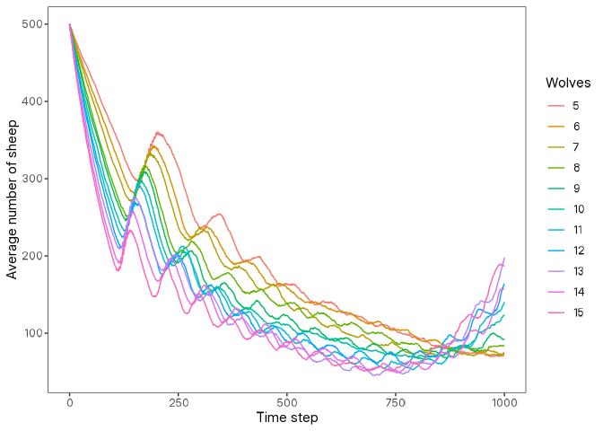

# logolink <a href = "https://danielvartan.github.io/brandr/"></a>

<!-- quarto render -->

<!-- badges: start -->
[](https://www.repostatus.org/#active)
[](https://cran.r-project.org/package=logolink)
[](https://doi.org/10.32614/CRAN.package.logolink)
[](https://cran.r-project.org/package=logolink)
[](https://github.com/danielvartan/logolink/actions)
[](https://app.codecov.io/gh/danielvartan/logolink)
[](https://www.gnu.org/licenses/gpl-3.0)
[](https://fairsoftwarechecklist.net/v0.2/?f=31&a=32113&i=32322&r=133)
[](https://fair-software.eu)
[](https://www.contributor-covenant.org/version/3/0/code_of_conduct/)
<!-- badges: end -->

## Overview

`logolink` is an [R](https://www.r-project.org/) package that simplifies
setting up and running [NetLogo](https://www.netlogo.org/) simulations
directly from R. It offers a modern, streamlined interface for running
models, following the [tidyverse
principles](https://tidyverse.tidyverse.org/articles/manifesto.html) and
integrating seamlessly with the broader [tidyverse
ecosystem](https://www.tidyverse.org/).

`logolink` is designed for NetLogo 7 and is not compatible with earlier
versions.

> If you find this project useful, please consider giving it a star!  
> [](https://github.com/danielvartan/logolink/)

## Another R Package for NetLogo?

While other R packages connect R and NetLogo, `logolink` is currently
the only one that fully supports the latest NetLogo release (NetLogo 7).
It is actively maintained, follows tidyverse conventions, and is
designed to be simple and straightforward to use.

For context, [`RNetLogo`](https://CRAN.R-project.org/package=RNetLogo)
works only with older versions (up to version 6.0.0, released in
December 2016) and has not been updated since June 2017.
[`nlrx`](https://CRAN.R-project.org/package=nlrx) provides a powerful
framework for managing experiments and results, but
[supports](https://docs.ropensci.org/nlrx/reference/supported_netlogo_versions.html)
only up to NetLogo 6.3.0 (released in September 2022) and has [many
unresolved issues](https://github.com/ropensci/nlrx/issues). `logolink`
complements these packages by focusing on simplicity, full compatibility
with NetLogo 7, and seamless integration into modern R workflows.

## Installation

You can install the released version of `logolink` from
[CRAN](https://CRAN.R-project.org) with:

``` r
install.packages("logolink")
```

And the development version from [GitHub](https://github.com/) with:

``` r
# install.packages("remotes")
remotes::install_github("danielvartan/logolink")
```

## Usage

`logolink` usage is very straightforward. The main functions are:

- [`create_experiment`](https://danielvartan.github.io/logolink/reference/create_experiment.html):
  Create a NetLogo BehaviorSpace experiment XML file.
- [`run_experiment`](https://danielvartan.github.io/logolink/reference/run_experiment.html):
  Run a NetLogo BehaviorSpace experiment.

Along with this package, you will also need NetLogo 7 or higher
installed on your computer. You can download it from the [NetLogo
website](https://www.netlogo.org).

### Setting the NetLogo Path

> [!IMPORTANT]
> The procedure for setting the NetLogo path has changed. If you are using the CRAN version of `logolink` (version 0.1.0). Click [here](https://github.com/danielvartan/logolink/tree/v0.1.0?tab=readme-ov-file#setting-the-netlogo-path) to see the old instructions.

`logolink` requires the path to the NetLogo installation to be set as an
environment variable named `NETLOGO_HOME` when running simulations. The
exact path varies depending on your operating system but is usually easy
to find. On Windows, for example, it typically looks like
`C:\Program Files\NetLogo 7.0.0`.

You can set this environment variable temporarily in your R session
using `Sys.setenv("NETLOGO_HOME" = "[PATH]")`, or permanently by adding
it to your [`.Renviron`](https://rstats.wtf/r-startup.html#renviron)
file.

Example (Windows):

``` r
Sys.setenv("NETLOGO_HOME" = file.path("C:", "Program Files", "NetLogo 7.0.0"))

Sys.getenv("NETLOGO_HOME")
#> [1] "C:\Program Files\NetLogo 7.0.0"
```

### Creating an Experiment

To start running your model from R you first need to setup an
experiment. You can do this by setting a
[BehaviorSpace](https://docs.netlogo.org/behaviorspace.html) experiment
with the
[`create_experiment`](https://danielvartan.github.io/logolink/reference/create_experiment.html)
function. This function will create a
[XML](https://en.wikipedia.org/wiki/XML) file that contains all the
information about your experiment, including the parameters to vary, the
metrics to collect, and the number of runs to perform.

Alternatively, you can set up your experiment directly in NetLogo and
save it as part of your model. In this case, you can skip the
[`create_experiment`](https://danielvartan.github.io/logolink/reference/create_experiment.html)
step and just provide the name of the experiment when running the model
with
[`run_experiment`](https://danielvartan.github.io/logolink/reference/run_experiment.html).

Example:

``` r
library(logolink)

setup_file <- create_experiment(
  name = "Wolf Sheep Simple Model Analysis",
  repetitions = 10,
  sequential_run_order = TRUE,
  run_metrics_every_step = TRUE,
  setup = "setup",
  go = "go",
  time_limit = 1000,
  metrics = c(
    'count wolves',
    'count sheep'
  ),
  run_metrics_condition = NULL,
  constants = list(
    "number-of-sheep" = 500,
    "number-of-wolves" = list(
      first = 5,
      step = 1,
      last = 15
    ),
    "movement-cost" = 0.5,
    "grass-regrowth-rate" = 0.3,
    "energy-gain-from-grass" = 2,
    "energy-gain-from-sheep" = 5
  )
)
```

``` r
setup_file |> inspect_experiment_file()
#> <experiments>
#>   <experiment name="Wolf Sheep Simple Model Analysis" repetitions="10" sequentialRunOrder="true" runMetricsEveryStep="true">
#>     <setup>setup</setup>
#>     <go>go</go>
#>     <timeLimit steps="1000"></timeLimit>
#>     <metric>count wolves</metric>
#>     <metric>count sheep</metric>
#>     <enumeratedValueSet variable="number-of-sheep">
#>       <value value="500"></value>
#>     </enumeratedValueSet>
#>     <steppedValueSet variable="number-of-wolves" first="5" step="1" last="15"></steppedValueSet>
#>     <enumeratedValueSet variable="movement-cost">
#>       <value value="0.5"></value>
#>     </enumeratedValueSet>
#>     <enumeratedValueSet variable="grass-regrowth-rate">
#>       <value value="0.3"></value>
#>     </enumeratedValueSet>
#>     <enumeratedValueSet variable="energy-gain-from-grass">
#>       <value value="2"></value>
#>     </enumeratedValueSet>
#>     <enumeratedValueSet variable="energy-gain-from-sheep">
#>       <value value="5"></value>
#>     </enumeratedValueSet>
#>   </experiment>
#> </experiments>
```

### Running an Experiment

With the experiment file created, you can now run your model using the
[`run_experiment`](https://danielvartan.github.io/logolink/reference/run_experiment.html)
function. This function will execute the NetLogo model with the
specified parameters and return the results as a tidy data frame.

``` r
model_path <-
  Sys.getenv("NETLOGO_HOME") |>
  file.path(
    "models", "IABM Textbook", "chapter 4", "Wolf Sheep Simple 5.nlogox"
  )
```

``` r
results <- run_experiment(
  model_path = model_path,
  setup_file = setup_file
)
```

``` r
library(dplyr)

results |> glimpse()
#> Rows: 110,110
#> Columns: 10
#> $ run_number             <dbl> 5, 8, 1, 9, 6, 3, 7, 2, 4, 5, 1, 8, 9, 3, 6,…
#> $ number_of_sheep        <dbl> 500, 500, 500, 500, 500, 500, 500, 500, 500,…
#> $ number_of_wolves       <dbl> 5, 5, 5, 5, 5, 5, 5, 5, 5, 5, 5, 5, 5, 5, 5,…
#> $ movement_cost          <dbl> 0.5, 0.5, 0.5, 0.5, 0.5, 0.5, 0.5, 0.5, 0.5,…
#> $ grass_regrowth_rate    <dbl> 0.3, 0.3, 0.3, 0.3, 0.3, 0.3, 0.3, 0.3, 0.3,…
#> $ energy_gain_from_grass <dbl> 2, 2, 2, 2, 2, 2, 2, 2, 2, 2, 2, 2, 2, 2, 2,…
#> $ energy_gain_from_sheep <dbl> 5, 5, 5, 5, 5, 5, 5, 5, 5, 5, 5, 5, 5, 5, 5,…
#> $ step                   <dbl> 0, 0, 0, 0, 0, 0, 0, 0, 0, 1, 1, 1, 1, 1, 1,…
#> $ count_wolves           <dbl> 5, 5, 5, 5, 5, 5, 5, 5, 5, 5, 5, 5, 5, 5, 5,…
#> $ count_sheep            <dbl> 500, 500, 500, 500, 500, 500, 500, 500, 500,…
```

### Analyzing the Data (Bonus Section)

Below is a simple example of how to visualize the results using
[`ggplot2`](https://ggplot2.tidyverse.org/).

``` r
library(dplyr)

data <-
  results |>
  group_by(step, number_of_wolves) |>
  summarise(
    across(everything(), ~ mean(.x, na.rm = TRUE))
  ) |>
  arrange(number_of_wolves, step)
```

``` r
library(ggplot2)

data |>
  mutate(number_of_wolves = as.factor(number_of_wolves)) |>
  ggplot(
    aes(
      x = step,
      y = count_sheep,
      group = number_of_wolves,
      color = number_of_wolves
    )
  ) +
    labs(
      x = "Time step",
      y = "Average number of sheep",
      color = "Wolves"
    ) +
  geom_line()
```



Please refer to the [BehaviorSpace
Guide](https://docs.netlogo.org/behaviorspace.html) for complete
guidance on how to set and run experiments in NetLogo. To gain a better
understand of the mechanics behind R and NetLogo communication, see the
[Running from the Command
Line](https://docs.netlogo.org/behaviorspace.html#running-from-the-command-line)
section.

Click [here](https://danielvartan.github.io/logolink/reference/) to see
`logolink` full list of functions.

## Citation

If you use this package in your research, please cite it to acknowledge
the effort put into its development and maintenance. Your citation helps
support its continued improvement.

``` r
citation("logolink")
#> To cite logolink in publications use:
#> 
#>   Vartanian, D. (2025). logolink: An interface for running NetLogo
#>   simulations from R [Computer software]. CRAN.
#>   https://doi.org/10.32614/CRAN.package.logolink
#> 
#> A BibTeX entry for LaTeX users is
#> 
#>   @Misc{,
#>     title = {logolink: An interface for running NetLogo simulations from R},
#>     author = {Daniel Vartanian},
#>     year = {2025},
#>     doi = {10.32614/CRAN.package.logolink},
#>     note = {Computer software},
#>   }
```

## License

[](https://www.gnu.org/licenses/gpl-3.0)

``` text
Copyright (C) 2025 Daniel Vartanian

logolink is free software: you can redistribute it and/or modify it under the
terms of the GNU General Public License as published by the Free Software
Foundation, either version 3 of the License, or (at your option) any later
version.

This program is distributed in the hope that it will be useful, but WITHOUT ANY
WARRANTY; without even the implied warranty of MERCHANTABILITY or FITNESS FOR A
PARTICULAR PURPOSE. See the GNU General Public License for more details.

You should have received a copy of the GNU General Public License along with
this program. If not, see <https://www.gnu.org/licenses/>.
```

## Contributing

[](https://www.contributor-covenant.org/version/3/0/code_of_conduct/)

Contributions are welcome! Whether you want to report bugs, suggest
features, or improve the code or documentation, your input is highly
valued. Please check the [issues
tab](https://github.com/danielvartan/logolink/issues) for existing
issues or to open a new one.

[](https://github.com/sponsors/danielvartan)

You can also support the development of `logolink` by becoming a
sponsor. Click [here](https://github.com/sponsors/danielvartan) to make
a donation. Please mention `logolink` in your donation message.

## Acknowledgments

`logolink` brand identity is based on the
[NetLogo](https://www.netlogo.org/) brand identity.
