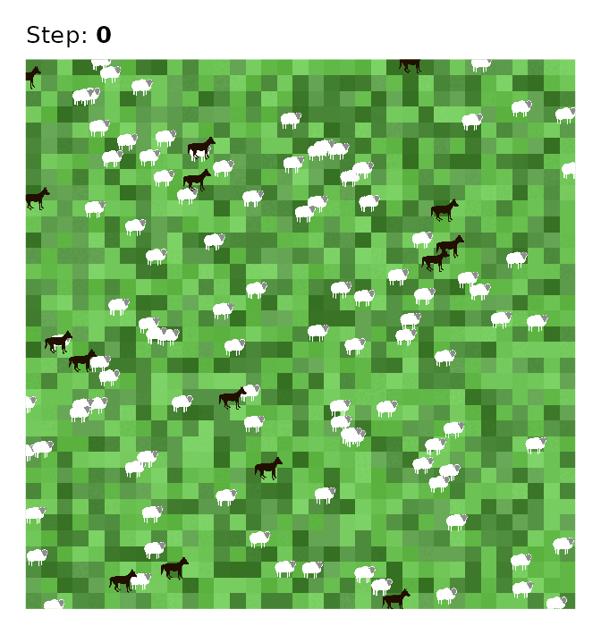

# Visualizing the NetLogo World

This vignette demonstrates how to visualize the NetLogo world using the
`logolink` package. This is useful for capturing special states and for
preparing materials for publication.

We will use the [Wolf Sheep
Simple](https://www.netlogoweb.org/launch#https://www.netlogoweb.org/assets/modelslib/IABM%20Textbook/chapter%204/Wolf%20Sheep%20Simple%205.nlogox)
model that comes with NetLogo as an example.

### Set the Environment

#### Load Packages

``` r
library(logolink)

library(cli)
library(curl)
library(dplyr)
library(ggplot2)
library(ggimage)
library(ggtext)
library(magick)
library(magrittr)
library(ragg)
library(stringr)
library(tidyr)
```

#### Define Model Path

``` r
model_path <-
  find_netlogo_home() |>
  file.path(
    "models",
    "IABM Textbook",
    "chapter 4",
    "Wolf Sheep Simple 5.nlogox"
  )
```

#### Get Turtle Shapes

See [`NetLogo-Shapes`](https://github.com/danielvartan/netlogo-shapes)
for more turtle shapes.

``` r
sheep_shape <-
  paste0(
    "https://raw.githubusercontent.com/danielvartan/",
    "netlogo-shapes/main/svg/netlogo-simplified/sheep.svg"
  ) |>
  curl_download(tempfile(fileext = ".svg"))
```

``` r
wolf_shape <-
  paste0(
    "https://raw.githubusercontent.com/danielvartan/",
    "netlogo-shapes/main/svg/netlogo-simplified/wolf.svg"
  ) |>
  curl_download(tempfile(fileext = ".svg"))
```

### Extract Agents Coordinates

#### Create Experiment Setup

``` r
setup_file <- create_experiment(
  name = "Wolf Sheep Simple Model Analysis",
  repetitions = 1,
  sequential_run_order = TRUE,
  run_metrics_every_step = FALSE,
  setup = "setup",
  go = "go",
  time_limit = 500,
  run_metrics_condition = 'ticks mod 100 = 0',
  metrics = c(
    '[xcor] of sheep',
    '[ycor] of sheep',
    '[xcor] of wolves',
    '[ycor] of wolves',
    '[pxcor] of patches',
    '[pycor] of patches',
    '[pcolor] of patches'
  ),
  constants = list(
    "number-of-sheep" = 100,
    "number-of-wolves" = 15,
    "movement-cost" = 0.5,
    "grass-regrowth-rate" = 0.3,
    "energy-gain-from-grass" = 2,
    "energy-gain-from-sheep" = 5
  )
)
```

#### Run Experiment

``` r
results <-
  model_path |>
  run_experiment(setup_file = setup_file)
```

``` r
results |>
  extract2("lists") |>
  glimpse()
#> Rows: 7,350
#> Columns: 16
#> $ run_number             <dbl> 1, 1, 1, 1, 1, 1, 1, 1, 1, 1, 1, 1, 1, 1, 1, 1,…
#> $ number_of_sheep        <dbl> 100, 100, 100, 100, 100, 100, 100, 100, 100, 10…
#> $ number_of_wolves       <dbl> 15, 15, 15, 15, 15, 15, 15, 15, 15, 15, 15, 15,…
#> $ movement_cost          <dbl> 0.5, 0.5, 0.5, 0.5, 0.5, 0.5, 0.5, 0.5, 0.5, 0.…
#> $ grass_regrowth_rate    <dbl> 0.3, 0.3, 0.3, 0.3, 0.3, 0.3, 0.3, 0.3, 0.3, 0.…
#> $ energy_gain_from_grass <dbl> 2, 2, 2, 2, 2, 2, 2, 2, 2, 2, 2, 2, 2, 2, 2, 2,…
#> $ energy_gain_from_sheep <dbl> 5, 5, 5, 5, 5, 5, 5, 5, 5, 5, 5, 5, 5, 5, 5, 5,…
#> $ step                   <dbl> 0, 0, 0, 0, 0, 0, 0, 0, 0, 0, 0, 0, 0, 0, 0, 0,…
#> $ index                  <chr> "0", "1", "2", "3", "4", "5", "6", "7", "8", "9…
#> $ pcolor_of_patches      <dbl> 55.73530, 55.97232, 55.63219, 55.77601, 55.3379…
#> $ pxcor_of_patches       <dbl> 14, 10, 15, -16, -2, -9, -5, 17, 16, -5, 6, 0, …
#> $ pycor_of_patches       <dbl> -1, 2, -2, 11, 0, -7, -4, 17, -11, 9, 13, -2, -…
#> $ xcor_of_sheep          <dbl> -9.619132, -8.212592, 10.868941, 1.809048, 3.66…
#> $ xcor_of_wolves         <dbl> -8.589280, -14.728250, -6.896075, -11.841407, 1…
#> $ ycor_of_sheep          <dbl> -1.0894000, 3.2207229, -17.3761865, -1.0036889,…
#> $ ycor_of_wolves         <dbl> 4.4027245, 1.1615005, 0.3095636, 14.6921098, 6.…
```

### Prepare Data

Parse NetLogo color codes to Hex colors using
[`parse_netlogo_color()`](https://danielvartan.github.io/logolink/reference/parse_netlogo_color.md).

``` r
plot_data <-
  results |>
  extract2("lists") |>
  dplyr::mutate(
    dplyr::across(
      .cols = dplyr::matches("^pcolor_of_patches|^color_of_"),
      .fns = parse_netlogo_color
    )
  )
```

### Plot World

``` r
plot_netlogo_world <- function(
  data,
  run_number = 1,
  step = 0,
  step_label = TRUE
) {
  data <-
    data |>
    filter(
      run_number == .env$run_number,
      step == .env$step
    )

  plot <-
    data |>
    ggplot(
      aes(
        x = pxcor_of_patches,
        y = pycor_of_patches,
        fill = pcolor_of_patches
      )
    ) +
    geom_raster() +
    coord_fixed(expand = FALSE) +
    geom_image(
      data = data |>
        drop_na(xcor_of_sheep),
      mapping = aes(
        x = xcor_of_sheep,
        y = ycor_of_sheep,
        image = sheep_shape
      ),
      size = 0.04
    ) +
    geom_image(
      data = data |>
        drop_na(xcor_of_wolves),
      mapping = aes(
        x = xcor_of_wolves,
        y = ycor_of_wolves,
        image = wolf_shape
      ),
      size = 0.055,
      color = parse_netlogo_color(31)
    ) +
    scale_fill_identity(na.value = parse_netlogo_color(7.5)) +
    theme_void() +
    theme(legend.position = "none")

  if (isTRUE(step_label)) {
    plot +
      labs(title = paste0("Step: **", step, "**")) +
      theme(
        plot.title.position = "plot",
        plot.title = element_markdown(
          size = 20,
          margin = margin(b = 10)
        ),
        plot.background = element_rect(fill = "white", color = NA),
        plot.margin = margin(1.5, 1.5, 1.5, 1.5, "line")
      )
  } else {
    plot
  }
}
```

``` r
plot_data |> plot_netlogo_world()
```


### Animate World

``` r
steps <- plot_data |>
  pull(step) |>
  unique()
```

``` r
steps
#> [1]   0 100 200 300 400 500
```

``` r
files <- character()

cli_progress_bar("Generating frames", total = length(steps))

for (i in steps) {
  step_label <- TRUE

  i_plot <-
    plot_data |>
    plot_netlogo_world(
      step = i,
      step_label = step_label
    )

  i_file <- tempfile(
    pattern = paste0("step-", i, "-"),
    fileext = ".png"
  )

  ggsave(
    filename = i_file,
    plot = i_plot,
    device = agg_png,
    width = 7,
    height = ifelse(isTRUE(step_label), 7.4, 7),
    units = "in",
    dpi = 96
  )

  files <- files |> append(i_file)

  cli_progress_update()
}
#> Generating frames ■■■■■■                            17% | ETA:  7s
#> Generating frames ■■■■■■■■■■■■■■■■■■■■■■■■■■        83% | ETA:  1s
#> Generating frames ■■■■■■■■■■■■■■■■■■■■■■■■■■■■■■■  100% | ETA:  0s

cli_progress_done()
```

``` r
animation <-
  files |>
  lapply(image_read) |>
  image_join() |>
  image_animate(fps = 1)
```

``` r
animation |>
  image_write(
    tempfile(
      pattern = "netlogo-world-animation-",
      fileext = ".gif"
    )
  )
```

``` r
animation
```


