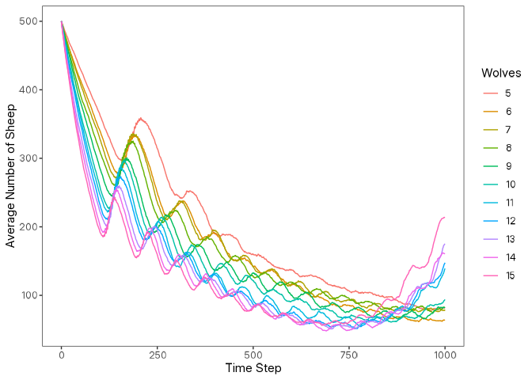

# logolink

## Overview

`logolink` is an [R](https://www.r-project.org/) package that simplifies
setting up and running [NetLogo](https://www.netlogo.org/) simulations
from R. It provides a modern, intuitive interface that follows
[tidyverse
principles](https://tidyverse.tidyverse.org/articles/manifesto.html) and
integrates seamlessly with the [tidyverse
ecosystem](https://tidyverse.org/).

The package is designed to work with NetLogo 7.0.1 and above. Earlier
versions are not supported. See NetLogo’s [Transition
Guide](https://docs.netlogo.org/transition.html) to upgrade your models
if needed.

> If you find this project useful, please consider giving it a star!  
> [](https://github.com/danielvartan/logolink/)

> The continuous development of `logolink` depends on community support.
> If you can afford to do so, please consider becoming a sponsor.  
> [](https://github.com/sponsors/danielvartan)

## Another R Package for NetLogo?

While other R packages connect R to NetLogo, `logolink` is currently the
only one that fully supports the latest NetLogo release. It is actively
maintained, follows [tidyverse
conventions](https://design.tidyverse.org/), and is designed to be
simple and straightforward to use.

For context, [`RNetLogo`](https://CRAN.R-project.org/package=RNetLogo)
supports only older versions (up to 6.0.0, released in December 2016)
and has not been updated since June 2017.
[`nlrx`](https://CRAN.R-project.org/package=nlrx) offers a powerful
framework for managing experiments and results, but
[supports](https://docs.ropensci.org/nlrx/reference/supported_netlogo_versions.html)
only up to NetLogo 6.3.0 (released in September 2022), requires
additional system dependencies, uses its own internal conventions that
diverge from NetLogo standards, and has [many unresolved
issues](https://github.com/ropensci/nlrx/issues).

`logolink` complements these packages by prioritizing simplicity,
offering finer control over output, ensuring full compatibility with
NetLogo 7, and integrating seamlessly with modern R workflows.

## Installation

You can install the released version of `logolink` from
[CRAN](https://CRAN.R-project.org) with:

``` r
install.packages("logolink")
```

And the development version from [GitHub](https://github.com/) with:

``` r
# install.packages("remotes")
remotes::install_github("danielvartan/logolink")
```

## Usage

`logolink` usage is very straightforward. The main functions are:

- [`create_experiment`](https://danielvartan.github.io/logolink/reference/create_experiment.html):
  Create NetLogo BehaviorSpace experiment
- [`run_experiment`](https://danielvartan.github.io/logolink/reference/run_experiment.html):
  Run NetLogo BehaviorSpace experiment

Along with this package, you will also need NetLogo 7.0.1 or higher
installed on your computer. You can download it from the [NetLogo
website](https://www.netlogo.org).

### Setting the Stage

After installing NetLogo and `logolink`, start by loading the package
with:

``` r
library(logolink)
```

`logolink` will try to find out the path to the NetLogo installation
automatically. This is usually successful, but if it fails, you can set
it manually. See the documentation for the
[`run_experiment`](https://danielvartan.github.io/logolink/reference/run_experiment.html)
function for more details.

To start our example analysis, we’ll need to first specify the path to
the NetLogo model.

This example uses Wilensky’s [Wolf Sheep
Simple](https://www.netlogoweb.org/launch#https://www.netlogoweb.org/assets/modelslib/IABM%20Textbook/chapter%204/Wolf%20Sheep%20Simple%205.nlogox)
model, a classic predator-prey simulation grounded in the
[Lotka-Volterra
equations](https://danielvartan.github.io/lotka-volterra/) developed by
Alfred J. Lotka
([1925](http://archive.org/details/elementsofphysic017171mbp)) and Vito
Volterra ([1926](https://www.nature.com/articles/118558a0)). Since this
model comes bundled with NetLogo, no download is required.

We’ll use
[`find_netlogo_home()`](https://danielvartan.github.io/logolink/reference/find_netlogo_home.html)
function to locate the NetLogo installation directory, then build the
path to the model file:

``` r
model_path <-
  find_netlogo_home() |>
  file.path(
    "models",
    "IABM Textbook",
    "chapter 4",
    "Wolf Sheep Simple 5.nlogox"
  )
```

### Creating an Experiment

To run the model from R, we’ll need to setup an experiment. We can do
this by setting a
[BehaviorSpace](https://docs.netlogo.org/behaviorspace.html) experiment
with the
[`create_experiment()`](https://danielvartan.github.io/logolink/reference/create_experiment.html)
function. This function will create a
[BehaviorSpace](https://docs.netlogo.org/behaviorspace.html)
[XML](https://en.wikipedia.org/wiki/XML) file that contains all the
information about the experiment, including the parameters to vary, the
metrics to collect, and the number of runs to perform.

``` r
setup_file <- create_experiment(
  name = "Wolf Sheep Simple Model Analysis",
  repetitions = 10,
  sequential_run_order = TRUE,
  run_metrics_every_step = TRUE,
  setup = "setup",
  go = "go",
  time_limit = 1000,
  metrics = c(
    'count wolves',
    'count sheep'
  ),
  run_metrics_condition = NULL,
  constants = list(
    "number-of-sheep" = 500,
    "number-of-wolves" = list(
      first = 5,
      step = 1,
      last = 15
    ),
    "movement-cost" = 0.5,
    "grass-regrowth-rate" = 0.3,
    "energy-gain-from-grass" = 2,
    "energy-gain-from-sheep" = 5
  )
)
```

Alternatively, you can set up your experiment [directly in
NetLogo](https://docs.netlogo.org/behaviorspace.html#how-it-works) and
save it as part of your model. In this case, you can skip the
[`create_experiment`](https://danielvartan.github.io/logolink/reference/create_experiment.html)
step and just provide the name of the experiment when running the model
with
[`run_experiment`](https://danielvartan.github.io/logolink/reference/run_experiment.html).

### Running the Simulation

With the experiment file created, we can now run the model using the
[`run_experiment()`](https://danielvartan.github.io/logolink/reference/run_experiment.html)
function. This function will execute the NetLogo model with the
specified parameters and return the results as [tidy data
frames](https://r4ds.hadley.nz/data-tidy.html).

``` r
results <-
  model_path |>
  run_experiment(
    setup_file = setup_file
  )
#> ✔ Running model [13.4s]
#> ✔ Gathering metadata [15ms]
#> ✔ Processing table output [8ms]
```

### Checking the Results

`logolink` supports the [four output
formats](https://docs.netlogo.org/behaviorspace.html#run-options-formats)
available in
[BehaviorSpace](https://docs.netlogo.org/behaviorspace.html):
[Table](https://docs.netlogo.org/behaviorspace.html#table-output),
[Spreadsheet](https://docs.netlogo.org/behaviorspace.html#spreadsheet-output),
[Lists](https://docs.netlogo.org/behaviorspace.html#lists-output), and
[Statistics](https://docs.netlogo.org/behaviorspace.html#statistics-output).
By default, only the
[Table](https://docs.netlogo.org/behaviorspace.html#table-output) format
is returned, along with some metadata about the experiment run.

``` r
library(dplyr)

results |> glimpse()
#> List of 2
#>  $ metadata:List of 6
#>   ..$ timestamp       : POSIXct[1:1], format: "2026-01-08 20:18:42"
#>   ..$ netlogo_version : chr "7.0.3"
#>   ..$ output_version  : chr "2.0"
#>   ..$ model_file      : chr "Wolf Sheep Simple 5.nlogox"
#>   ..$ experiment_name : chr "Wolf Sheep Simple Model Analysis"
#>   ..$ world_dimensions: Named int [1:4] -17 17 -17 17
#>   .. ..- attr(*, "names")= chr [1:4] "min-pxcor" "max-pxcor" "min-pycor" "max-pycor"
#>  $ table   : tibble [110,110 × 10] (S3: tbl_df/tbl/data.frame)
#>   ..$ run_number            : num [1:110110] 1 1 1 1 1 1 1 1 1 1 ...
#>   ..$ number_of_sheep       : num [1:110110] 500 500 500 500 500 500 500 500 500 500 ...
#>   ..$ number_of_wolves      : num [1:110110] 5 5 5 5 5 5 5 5 5 5 ...
#>   ..$ movement_cost         : num [1:110110] 0.5 0.5 0.5 0.5 0.5 0.5 0.5 0.5 0.5 0.5 ...
#>   ..$ grass_regrowth_rate   : num [1:110110] 0.3 0.3 0.3 0.3 0.3 0.3 0.3 0.3 0.3 0.3 ...
#>   ..$ energy_gain_from_grass: num [1:110110] 2 2 2 2 2 2 2 2 2 2 ...
#>   ..$ energy_gain_from_sheep: num [1:110110] 5 5 5 5 5 5 5 5 5 5 ...
#>   ..$ step                  : num [1:110110] 0 1 2 3 4 5 6 7 8 9 ...
#>   ..$ count_wolves          : num [1:110110] 5 5 5 5 5 5 5 5 5 5 ...
#>   ..$ count_sheep           : num [1:110110] 500 500 499 499 496 495 495 493 492 490 ...
```

If you already have a file with experiment results, you can read it into
R using the
[`read_experiment()`](https://danielvartan.github.io/logolink/reference/read_experiment.html)
function, which will produce the same output structure as
[`run_experiment()`](https://danielvartan.github.io/logolink/reference/run_experiment.html).

### Analyzing the Data (Bonus Section)

Below is a simple example of how to visualize the results using
[`ggplot2`](https://ggplot2.tidyverse.org/).

``` r
library(dplyr)
library(magrittr)

data <-
  results |>
  extract2("table") |>
  select(where(is.numeric)) |>
  summarize(
    across(everything(), ~ mean(.x, na.rm = TRUE)),
    .by = c(step, number_of_wolves)
  ) |>
  arrange(number_of_wolves, step)
```

``` r
library(ggplot2)

data |>
  mutate(number_of_wolves = as.factor(number_of_wolves)) |>
  ggplot(
    aes(
      x = step,
      y = count_sheep,
      group = number_of_wolves,
      color = number_of_wolves
    )
  ) +
  geom_line() +
  labs(
    x = "Time Step",
    y = "Average Number of Sheep",
    color = "Wolves"
  )
```



### Visualizing the NetLogo World (Bonus Section)

`logolink` also includes tutorials to help you get the most out of
NetLogo in R. The [Visualizing the NetLogo
World](https://danielvartan.github.io/logolink/articles/visualizing-the-netlogo-world.html)
tutorial demonstrates how to plot the NetLogo world at specific time
steps and animate its evolution over time.


Click [here](https://danielvartan.github.io/logolink/reference/) to see
the full list of `logolink` functions.

For complete guidance on setting up and running experiments in NetLogo,
please refer to the [BehaviorSpace
Guide](https://docs.netlogo.org/behaviorspace.html).

## Citation

[](https://doi.org/10.32614/CRAN.package.logolink)

If you use this package in your research, please cite it to acknowledge
the effort put into its development and maintenance. Your citation helps
support its continued improvement.

``` r
citation("logolink")
#> To cite logolink in publications use:
#> 
#>   Vartanian, D. (2026). logolink: An interface for running NetLogo
#>   simulations from R [Computer software]. CRAN.
#>   https://doi.org/10.32614/CRAN.package.logolink
#> 
#> A BibTeX entry for LaTeX users is
#> 
#>   @Misc{,
#>     title = {logolink: An interface for running NetLogo simulations from R},
#>     author = {Daniel Vartanian},
#>     year = {2026},
#>     doi = {10.32614/CRAN.package.logolink},
#>     note = {Computer software},
#>   }
```

## License

[](https://www.gnu.org/licenses/gpl-3.0)

``` text
Copyright (C) 2025 Daniel Vartanian

logolink is free software: you can redistribute it and/or modify it under the
terms of the GNU General Public License as published by the Free Software
Foundation, either version 3 of the License, or (at your option) any later
version.

This program is distributed in the hope that it will be useful, but WITHOUT ANY
WARRANTY; without even the implied warranty of MERCHANTABILITY or FITNESS FOR A
PARTICULAR PURPOSE. See the GNU General Public License for more details.

You should have received a copy of the GNU General Public License along with
this program. If not, see <https://www.gnu.org/licenses/>.
```

## Contributing

[](https://www.contributor-covenant.org/version/3/0/code_of_conduct/)

Contributions are always welcome! Whether you want to report bugs,
suggest new features, or help improve the code or documentation, your
input makes a difference.

Before opening a new issue, please check the [issues
tab](https://github.com/danielvartan/logolink/issues) to see if your
topic has already been reported.

[](https://github.com/sponsors/danielvartan)

You can also support the development of `logolink` by becoming a
sponsor.

Click [here](https://github.com/sponsors/danielvartan) to make a
donation. Please mention `logolink` in your donation message.

## Acknowledgments

`logolink` brand identity is based on the [NetLogo
7](https://www.netlogo.org/) brand identity.
